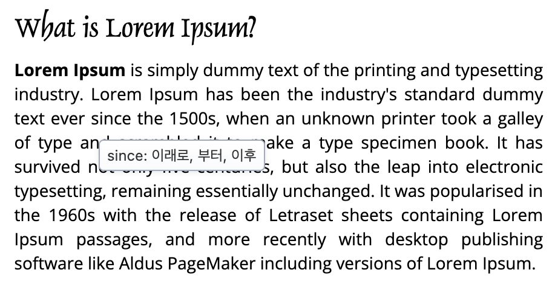
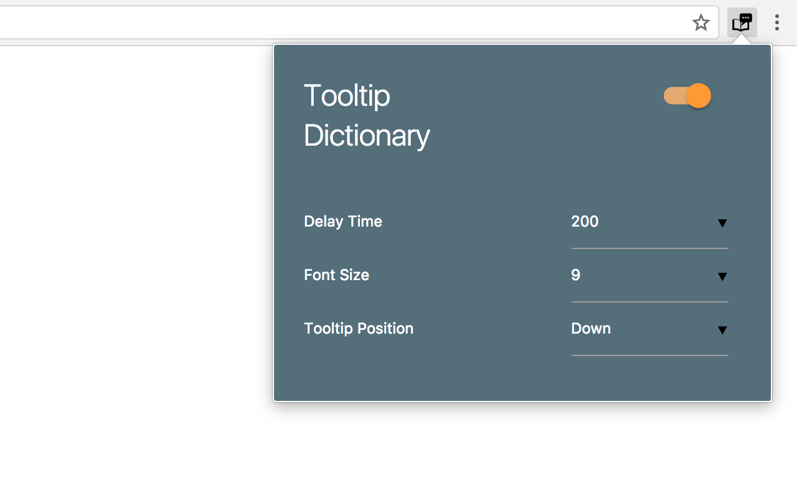

# tooltip-dictionary

## Goals
* Chrome 확장 Manifest V3 지원 추가
* Chrome 확장 스토어에 업로드

## Notes
* 소스 출처: https://chromewebstore.google.com/detail/tooltip-dictionary/kibbnopaghnmdlmocibfmnljlihmlgip
* 소스 추출기: https://crxextractor.com/
* 관련 자료:
  * [간편한 웹 사전 툴팁 사전 - 크롬 확장기능](https://codexromanoff.tistory.com/187)
  * [크롬 툴팁 사전 확장기능](https://just4kox.blogspot.com/2010/08/%ED%81%AC%EB%A1%AC-%ED%88%B4%ED%8C%81-%EC%82%AC%EC%A0%84-%ED%99%95%EC%9E%A5%EA%B8%B0%EB%8A%A5.html)
  * [tooltip-dictionary](https://github.com/seoh/tooltip-dictionary)
* 현재 마켓 심사 중. 심사가 완료되면 https://chromewebstore.google.com/detail/ddoapcmacpdaiimdpelaolkeacbhbbgj 에서 다운로드 가능.
