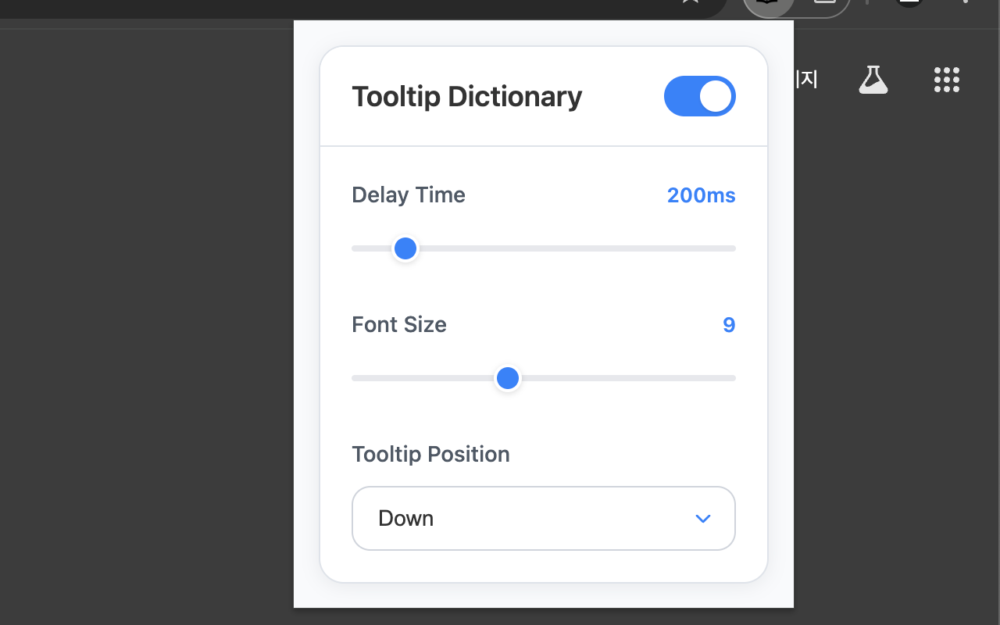

# tooltip-dictionary
- [Chrome Web Store에서 다운로드](https://chromewebstore.google.com/detail/ddoapcmacpdaiimdpelaolkeacbhbbgj)
- 기존 확장 프로그램을 이어받아 유지보수 및 개선 진행 중입니다.
- ✅ Manifest V2 → V3 마이그레이션 완료. 더 이상 Chrome이 삭제하거나 불평하지 않음.
- ✅ 다운된 네이버 사전 API 서버 대신, 생성형 AI 모델을 활용 완료. 일단 개발자 사비로 비용 지출.
- ✅ 유지보수성 개선을 위한 WXT 프레임워크 마이그레이션 완료.
- ✅ 확장 프로그램 UI 개선, 단어 추출 알고리즘 정확도 향상 완료.

## Screenshots
 

## Notes
- 소스 출처: https://chromewebstore.google.com/detail/tooltip-dictionary/kibbnopaghnmdlmocibfmnljlihmlgip
- 소스 추출기: https://crxextractor.com/
- 관련 자료:
  - [간편한 웹 사전 툴팁 사전 - 크롬 확장기능](https://codexromanoff.tistory.com/187)
  - [크롬 툴팁 사전 확장기능](https://just4kox.blogspot.com/2010/08/%ED%81%AC%EB%A1%AC-%ED%88%B4%ED%8C%81-%EC%82%AC%EC%A0%84-%ED%99%95%EC%9E%A5%EA%B8%B0%EB%8A%A5.html)
  - [tooltip-dictionary](https://github.com/seoh/tooltip-dictionary)
- 빌드: `pnpm install`, 개발 서버 실행: `pnpm dev`, ZIP 파일 압축: `pnpm zip`
- 일단 현재의 사용은 무료입니다. 추후 서버 비용이 너무 많이 나오면 충당을 위해 기부 등을 받을 수도 있습니다.
